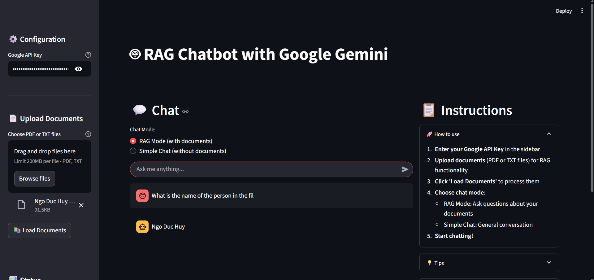

# 🤖 RAG Chatbot with Google Gemini

[](https://streamlit.io/)
[](https://python.org/)
[](https://ai.google.dev/)
[](https://langchain.com/)

A powerful **Retrieval-Augmented Generation (RAG)** chatbot built with **Google Gemini API**, specifically designed for analyzing **research papers with 2-column layouts**. Features advanced PDF processing and intelligent document analysis optimized for academic content and scientific publications.



## ✨ Features

### 🧠 **Google Gemini Integration**
- **Gemini-1.5-flash** for intelligent text generation and conversation
- **GoogleGenerativeAI embeddings** for semantic document retrieval
- Advanced prompt engineering for accurate responses

### 📄 **Advanced Research Paper Processing**
- **🔬 2-Column PDF Support**: Specialized handling for academic paper layouts
- **📰 Multi-column text extraction** with proper reading order preservation
- **🧠 Research-optimized chunking** for academic content and citations
- **📑 Text file support** (.txt) for supplementary documents
- **🔄 Automatic fallback** to standard extraction methods when needed

### 💬 **Research-Focused Chat Modes**
- **🔍 RAG Mode**: Ask specific questions about your research papers
- **💭 Simple Chat**: General academic discussion with memory retention
- **📚 Multi-paper analysis** for comprehensive literature reviews

### 🎨 **Academic-Optimized Interface**
- Clean, responsive design optimized for research workflows
- Real-time research paper processing status
- Interactive file upload with drag-and-drop for PDF papers
- Research-specific help panels and sample questions
- Mobile-friendly layout for on-the-go research

## 🚀 Quick Start

### Prerequisites
- Python 3.8 or higher
- Google API key for Gemini ([Get one here](https://makersuite.google.com/app/apikey))

### Installation

1. **Clone the repository**
```bash
git clone https://github.com/ndhuy05/Research-Paper-RAG-Chatbot.git
cd Research-Paper-RAG-Chatbot
```

2. **Install dependencies**
```bash
pip install -r requirements.txt
```

3. **Run the application**
```bash
streamlit run streamlit_app.py
```

4. **Open your browser** and navigate to `http://localhost:8501`

## 🔧 Configuration

### API Key Setup
1. Visit [Google AI Studio](https://makersuite.google.com/app/apikey)
2. Create a new API key
3. Enter the key in the Streamlit sidebar when prompted

### Environment Variables (Optional)
```bash
export GOOGLE_API_KEY="your-api-key-here"
```

## 📚 Usage Guide

### 1. **Research Paper Upload**
- Drag and drop **2-column academic PDF papers** into the upload area
- Click "Load Documents" to process and index your research papers
- Wait for the "✅ Documents loaded" confirmation

### 2. **Choose Research Mode**
- **RAG Mode**: Ask questions about your uploaded research papers
- **Simple Chat**: General academic conversation without paper context

### 3. **Start Your Research Analysis**
- Type your research questions in the chat input
- Use the sample questions designed for academic papers
- Clear conversation history when switching between papers

### 📖 **Best Practices for Research Papers**
```
✅ Upload clear, text-based PDFs (not scanned research papers)
✅ Focus on 2-column academic papers (IEEE, ACM, nature, etc.)
✅ Ask specific questions about methodology, results, conclusions
✅ Upload multiple related papers for comprehensive literature analysis
✅ Try sample questions to understand research capabilities
```

## 🛠️ Technical Architecture

### Core Components
- **LangChain Framework**: Academic document processing and chain management
- **FAISS Vector Store**: Efficient similarity search optimized for research content
- **Google Gemini API**: Natural language understanding for academic queries
- **PyMuPDF**: Advanced 2-column PDF text extraction with proper column detection
- **Streamlit**: Interactive web interface for researchers

### Research Paper Processing Pipeline
```
📄 2-Column PDF Upload → 🔧 Column-Aware Extraction → ✂️ Academic Chunking → 🧠 Research Embeddings → 🗃️ Vector Store → 🔍 Paper Retrieval → 💬 Academic Response
```

## 📁 Project Structure

```
Research-Paper-RAG-Chatbot/
├── 📄 streamlit_app.py      # Main research paper analysis app
├── 📄 requirements.txt      # Python dependencies
├── 📄 README.md            # Project documentation
├── 📄 run_app.bat          # Windows batch runner
├── 🖼️ img/
│   └── demo.jpg            # Demo screenshot
└── 📁 sample_papers/       # Sample research papers (optional)
```

## 🔗 Dependencies

| Package | Purpose | Research Focus |
|---------|---------|----------------|
| `streamlit` | Web interface | Research-friendly UI |
| `langchain` | LLM framework | Academic content processing |
| `langchain-google-genai` | Gemini integration | Research paper analysis |
| `langchain-community` | Document loaders | PDF research paper support |
| `faiss-cpu` | Vector database | Semantic research search |
| `PyMuPDF` | PDF processing | 2-column layout handling |
| `pypdf` | PDF fallback | Research paper backup parsing |

## 🎯 Research Use Cases

### 📚 **Academic Research & Literature Review**
- Analyze multiple research papers with 2-column layouts
- Extract key insights from scientific publications
- Compare methodologies across different studies
- Generate comprehensive literature review summaries
- Identify research gaps and future directions

### � **Scientific Paper Analysis**
- Process IEEE, ACM, Springer, Nature format papers
- Extract experimental results and statistical data
- Analyze research methodologies and approaches
- Compare findings across multiple publications

### � **Academic Document Processing**
- Handle conference proceedings and journal articles
- Process technical research reports and whitepapers
- Create searchable academic knowledge repositories
- Support systematic literature reviews

## 🔧 Advanced Configuration

### Model Settings (Optimized for Research Papers)
```python
# Text Generation - Tuned for academic content
model: "gemini-1.5-flash"
temperature: 0.7

# Embeddings - Optimized for research terminology
embedding_model: "models/embedding-001"

# Retrieval - Configured for research paper sections
chunk_size: 1500        # Ideal for academic paragraphs
chunk_overlap: 300      # Maintains research context
retrieval_k: 5          # Multiple relevant sections
```

### Customization Options for Research
- Modify chunk size for different paper structures (abstracts, methods, results)
- Adjust temperature for more creative or precise academic responses
- Configure retrieval parameters for better citation accuracy

## 🐛 Troubleshooting

| Issue | Solution | Research Context |
|-------|----------|------------------|
| **PyMuPDF not available** | `pip install PyMuPDF` | Required for 2-column PDF processing |
| **API key errors** | Verify key is valid and has Gemini access | Needed for research paper analysis |
| **PDF extraction fails** | App automatically falls back to standard extraction | Works with most academic PDFs |
| **Slow processing** | Try smaller papers or reduce chunk size | Large research papers take time |
| **Column detection issues** | Ensure PDFs are text-based, not scanned | 2-column detection needs clear text |

## 🤝 Contributing

1. Fork the repository
2. Create a feature branch (`git checkout -b feature/amazing-feature`)
3. Commit your changes (`git commit -m 'Add amazing feature'`)
4. Push to the branch (`git push origin feature/amazing-feature`)
5. Open a Pull Request

## 📄 License

This project is licensed under the MIT License - see the [LICENSE](LICENSE) file for details.

## 🙏 Acknowledgments

- [Google AI](https://ai.google.dev/) for the Gemini API
- [LangChain](https://langchain.com/) for the excellent framework
- [Streamlit](https://streamlit.io/) for the beautiful UI framework
- [PyMuPDF](https://pymupdf.readthedocs.io/) for advanced PDF processing

## 📞 Support

- 🐛 **Bug Reports**: [Create an issue](https://github.com/YOUR_USERNAME/Research-Paper-RAG-Chatbot/issues)
- 💡 **Feature Requests**: [Start a discussion](https://github.com/YOUR_USERNAME/Research-Paper-RAG-Chatbot/discussions)
- 📧 **Email**: your.email@example.com

---

⭐ **Star this repository if you find it helpful!**

[](https://github.com/YOUR_USERNAME/Research-Paper-RAG-Chatbot)
